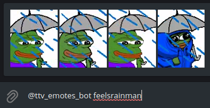

# <p align="center"> [ttv-emotes-bot](http://t.me/ttv_emotes_bot)
<p align="center"> 
<p align="center"> telegram bot for sending twitch.tv emotes

# Contents

* [Getting started.](#getting-started)
    * [Requirements](#requirements)
    * [Installation](#installation)
    * [Logs](#logs)
    * [Env files](#env-files)
* [Usage](#usage)
    * [Example](#example)

## Getting started

### Requirements
- `docker-compose` in version `1.25.0`
- `docker` in version `20.10.7`

### Installation
```bash
git clone https://github.com/miloszowi/ttv-emotes-telegram-bot.git
```
after that, you need to copy env files and fulfill it with correct values
```bash
cp docker/config/app.dist.env docker/config/app.env
cp docker/config/database.dist.env docker/config/app.env
```
and finally, you can run the bot by launching docker containers
```bash
docker-compose up -d
```
(`-d` flag will run containers in detached mode)

Unfortunately, BetterTTV does not provide documentation for their api.
It has to be scrapped and can't be directly asked by emote code.
To process scraping and saving emotes into mongo database, process with:
```bash
docker/import-emotes
```
### Logs
You can use
```bash
docker/logs <container>
```
to check container logs
### Env files
app.env
- `BOT_TOKEN` - your telegram bot token from [BotFather](https://telegram.me/BotFather)
- `MONGODB_DATABASE` - MongoDB database name
- `MONGODB_USERNAME` - MongoDB username
- `MONGODB_PASSWORD` - MongoDB password
- `MONGODB_HOSTNAME` - MongoDB host (default `database` - container name)
- `MONGODB_PORT` - MongoDB port (default `27017` - given in docker-compose configuration)

database.env
- `MONGO_INITDB_ROOT_USERNAME` - conf from `app.env`
- `MONGO_INITDB_ROOT_PASSWORD` - conf from `app.env`
- `MONGO_INITDB_DATABASE` - conf from `app.env`
- `MONGODB_DATA_DIR` - directory to store MongoDB documents (inside a container)
- `MONDODB_LOG_DIR` - path to logs storage 
## Commands
Tag the bot with `@ttv_emotes_bot` and then your emote code, bot will handle your query and display you possible results.

### Example


You don't need to finish your emote code, bot will try to match your already given expression to existing emotes.